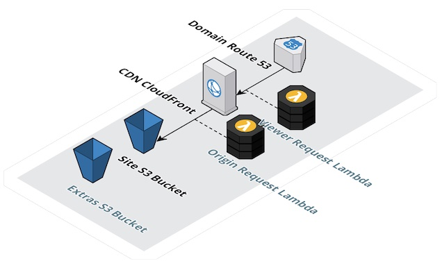

 

Terraform AWS Kon-Tiki
----------------------

Terraform AWS Kon-Tiki is a Terraform module for provisioning infrastructure on AWS for hosting static websites with https support and request processing functions on the CDN.

This module provisions the following AWS resources:

* Site S3 Bucket - for storing the [static website](https://docs.aws.amazon.com/AmazonS3/latest/userguide/WebsiteHosting.html) assets (e.g. HTML, JavaScript, CSS, image files, etc)
* CDN CloudFront - for caching the static assets, providing https endpoint, and [many other CDN capabilities](https://en.wikipedia.org/wiki/Amazon_CloudFront)
* Domain Route 53 - for provisioning the website's DNS record within a configured zone

It also provides the following optional AWS resources:

* Viewer Request Lambda - Lambda@Edge function for processing request after it's received from viewer (before it hits the CDN), e.g. for adding HTTP basic authentication
* Origin Request Lambda - Lambda@Edge function for processing request before it's forwarded to origin (before it hits the S3 bucket), e.g. for serving `index.html` as default page for every path
* Extras S3 Bucket - for storing any additional assets that requires pre-processing before being stored in Site S3 Bucket

Architecture
------------

]

Installation
------------

Copy paste below code into your Terraform configuration, insert the variables, and run `terraform init`:

    module "kon_tiki" {
      source  = "cliffano/kon-tiki/aws"
      version = "0.10.0"
    }

Usage
-----

    module "kon_tiki" {
      source                       = "cliffano/kon-tiki/aws"
      version                      = "0.10.0"
      region                       = "ap-southeast-2"
      acm_certificate_arn          = "arn:aws:acm:us-east-1:123456789012:certificate/21f01ef7-f64d-427a-9b5c-55178a46d6a0"
      route53_domain               = "somesite.somedomain.com"
      route53_zone_id              = "Z09836883JG7GHJIUIPJA"
      s3_bucket_cdn_log            = "somecdnlog"
      s3_bucket_site               = "somesite.somedomain.com"
      enable_s3_bucket_extras      = true
      s3_bucket_extras             = "someextras.somedomain.com"
      enable_lambda_viewer_request = true
      lambda_viewer_request_arn    = "arn:aws:lambda:us-east-1:123456789012:function:serverlessrepo-wehr-enter-LambdaAuthorizerBasicAut-wnvuW5BxvLWY:1"
      enable_lambda_origin_request = true
      lambda_origin_request_arn    = "arn:aws:lambda:us-east-1:123456789012:function:serverlessrepo-digital-sa-StandardRedirectsForClou-BLIGK4EUES3T:1"
      tags = {
        tag1 = "value1"
        tag2 = "value2"
      }
    }

FAQ
---

*Q: Why doesn't this module provision an ACM certificate and a Route53 zone?*

A: Those two resources are purposely left out in order to allow the usage of pre-existing ACM certificate and Route53 zone. An ACM certificate could be provisioned in many ways, sometimes the certificate need to be produced by a non-AWS certificate authority, and sometimes users prefer different ways to validate ownership. As for Route53 zone, the static website usually tend to be one of the tenants of a zone, hence the zone ownership shouldn't live with this module.

*Q: Why doesn't the resulting website serve `index.html` by default?*

A: That is the default behaviour of S3 static website. If you would like to have `index.html` as the default page for every path, i.e. when a request is sent to `/hello` and you would like `/hello/index.html` to be served, then I recommend setting up Viewer Request Lambda using Lambda@Edge function from [standard-redirects-for-cloudfront](https://serverlessrepo.aws.amazon.com/applications/arn:aws:serverlessrepo:us-east-1:621073008195:applications~standard-redirects-for-cloudfront), and configure the function's ARN in `lambda_origin_request_arn` (don't forget to set `enable_lambda_origin_request` to `true`).

*Q: How to add HTTP basic authentication support?*

A: I recommend setting up Origin Request Lambda using Lambda@Edge function from [lambda-authorizer-basic-auth](https://serverlessrepo.aws.amazon.com/applications/arn:aws:serverlessrepo:us-east-1:560348900601:applications~lambda-authorizer-basic-auth), and configure the function's ARN in `lambda_viewer_request_arn` (don't forget to set `enable_lambda_viewer_request` to `true`).

# Terraform Doc
## Requirements

| Name | Version |
|------|---------|
|  [terraform](#requirement\_terraform) | >= 1.6.6 |
|  [aws](#requirement\_aws) | ~> 5.0 |

## Providers

| Name | Version |
|------|---------|
|  [aws](#provider\_aws) | 5.33.0 |

## Modules

No modules.

## Resources

| Name | Type |
|------|------|
| [aws_cloudfront_distribution.cdn](https://registry.terraform.io/providers/hashicorp/aws/latest/docs/resources/cloudfront_distribution) | resource |
| [aws_cloudfront_origin_access_identity.cdn_oai](https://registry.terraform.io/providers/hashicorp/aws/latest/docs/resources/cloudfront_origin_access_identity) | resource |
| [aws_route53_record.domain](https://registry.terraform.io/providers/hashicorp/aws/latest/docs/resources/route53_record) | resource |
| [aws_s3_bucket.extras](https://registry.terraform.io/providers/hashicorp/aws/latest/docs/resources/s3_bucket) | resource |
| [aws_s3_bucket.site](https://registry.terraform.io/providers/hashicorp/aws/latest/docs/resources/s3_bucket) | resource |
| [aws_s3_bucket_public_access_block.extras_private](https://registry.terraform.io/providers/hashicorp/aws/latest/docs/resources/s3_bucket_public_access_block) | resource |
| [aws_s3_bucket_public_access_block.site_private](https://registry.terraform.io/providers/hashicorp/aws/latest/docs/resources/s3_bucket_public_access_block) | resource |

## Inputs

| Name | Description | Type | Default | Required |
|------|-------------|------|---------|:--------:|
|  [acm\_certificate\_arn](#input\_acm\_certificate\_arn) | ARN of SSL certificate in ACM | `string` | `null` | no |
|  [enable\_lambda\_origin\_request](#input\_enable\_lambda\_origin\_request) | Enable the provisioning of CloudFront Lambda Edge origin request | `bool` | `false` | no |
|  [enable\_lambda\_viewer\_request](#input\_enable\_lambda\_viewer\_request) | Enable the provisioning of CloudFront Lambda Edge viewer request | `bool` | `false` | no |
|  [enable\_s3\_bucket\_extras](#input\_enable\_s3\_bucket\_extras) | Enable the provisioning of S3 bucket for extra files | `bool` | `false` | no |
|  [lambda\_origin\_request\_arn](#input\_lambda\_origin\_request\_arn) | ARN of Lambda Function to be used as origin-request CloudFront Lambda@Edge | `string` | `"kon-tiki-lambda-origin-request-arn"` | no |
|  [lambda\_viewer\_request\_arn](#input\_lambda\_viewer\_request\_arn) | ARN of Lambda Function to be used as viewer-request CloudFront Lambda@Edge | `string` | `"kon-tiki-lambda-viewer-request-arn"` | no |
|  [region](#input\_region) | AWS region https://docs.aws.amazon.com/AmazonRDS/latest/UserGuide/Concepts.RegionsAndAvailabilityZones.html | `string` | `"ap-southeast-2"` | no |
|  [route53\_domain](#input\_route53\_domain) | Route53 record to be used as the domain name of the web site | `string` | `null` | no |
|  [route53\_zone\_id](#input\_route53\_zone\_id) | Route53 hosted zone ID where the domain will be added to | `string` | `null` | no |
|  [s3\_bucket\_cdn\_log](#input\_s3\_bucket\_cdn\_log) | Name of S3 bucket for storing CDN log | `string` | `null` | no |
|  [s3\_bucket\_extras](#input\_s3\_bucket\_extras) | Name of S3 bucket for storing extra files | `string` | `"kon-tiki-s3-bucket-extras"` | no |
|  [s3\_bucket\_site](#input\_s3\_bucket\_site) | Name of S3 bucket for storing web site content | `string` | `null` | no |
|  [tags](#input\_tags) | Tags to be added to all taggable AWS resources provisioned by Terraform Kon-Tiki | `map` | <pre>{   "generator_name": "kon-tiki",   "generator_version": "0.9.0" }</pre> | no |

## Outputs

| Name | Description |
|------|-------------|
|  [cloudfront\_distribution\_cdn](#output\_cloudfront\_distribution\_cdn) | Provisioned CloudFront distribution resource |
|  [route53\_record\_domain](#output\_route53\_record\_domain) | Provisioned Route53 record resource |
|  [s3\_bucket\_site](#output\_s3\_bucket\_site) | Provisioned S3 bucket resource |
